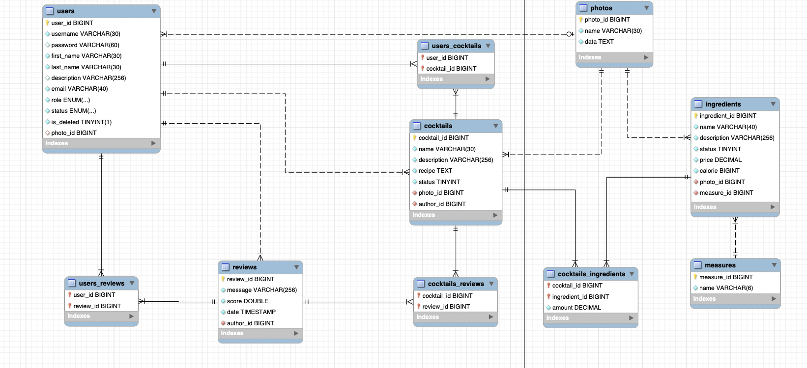

# Bartender helper
## User roles

### Guest
- can view verified ingredients
- can search verified ingredients or cocktails
- can view cocktails
- can view users profile
- can change the language
- can sign up
- can log in

### Client
- can view verified ingredients
- can search verified ingredients or cocktails
- can view cocktails
- can add cocktail to favorite
- can change the language
- can view own profile
- can comment other users and cocktails
- can rate other users and cocktails
- can delete his account
- can edit his account
- can log out

### Bartender
- can view all ingredients
- can search all ingredients or cocktails
- can offer new ingredient
- can view cocktails
- can add cocktail to favorite
- can create cocktail
- can change the language
- can view own profile
- can comment other users and cocktails
- can rate other users and cocktails
- can delete his account
- can edit his account
- can log out

### Admin
- can view all ingredients
- can search all ingredients or cocktails
- can create ingredient
- can edit ingredient
- can view cocktails
- can add cocktail to favorite
- can change the language
- can view own profile
- can comment other users and cocktails
- can rate other users and cocktails
- can delete his account
- can edit his account
- can edit other accounts
- can block and unblock other users
- can log out

